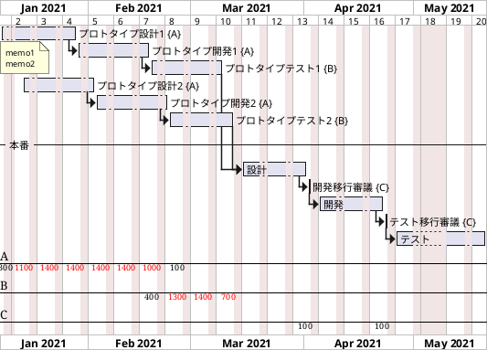

[PlantUML のガントチャート](https://plantuml.com/ja/gantt-diagram) でだいぶいろいろと書けるようになったみたいなので試してみた。
個人で計画を練るときにはこれで良いかもしれない。

```plantuml:gantt.pu
@startgantt
Project starts 2021-01-08
sunday are closed
saturday are closed
2021-01-11 is closed
2021-05-03 to 2021-05-07 is closed

printscale weekly

[プロトタイプ設計1] as [pdesign1] on {A} lasts 14 days
note bottom
  memo1
  memo2
end note
[プロトタイプ開発1] as [pdev1] on {A} lasts 14 days
[プロトタイプテスト1] as [ptest1] on {B} lasts 14 days

/' [pdev] starts at [pdesign]'s end '/
[pdesign1] -> [pdev1]
[pdev1] -> [ptest1]

[プロトタイプ設計2] as [pdesign2] on {A} lasts 14 days and starts 2021-01-14
[プロトタイプ開発2] as [pdev2] on {A} lasts 14 days
[プロトタイプテスト2] as [ptest2] on {B} lasts 14 days

[pdesign2] -> [pdev2]
[pdev2] -> [ptest2]

-- 本番 --

[設計] as [design] lasts 14 days
/' [開発移行審議] as [pmig] happens at [ptest]'s end '/
[開発移行審議] as [dmig] on {C} lasts 1 days
[開発] as [dev] lasts 14 days
[テスト移行審議] as [tmig] on {C} lasts 1 days
[テスト] as [test] lasts 14 days

[ptest1] -> [design]
[ptest2] -> [design]
[design] -> [dmig]
[dmig] -> [dev]
[dev] -> [tmig]
[tmig] -> [test]

@endgantt
```
